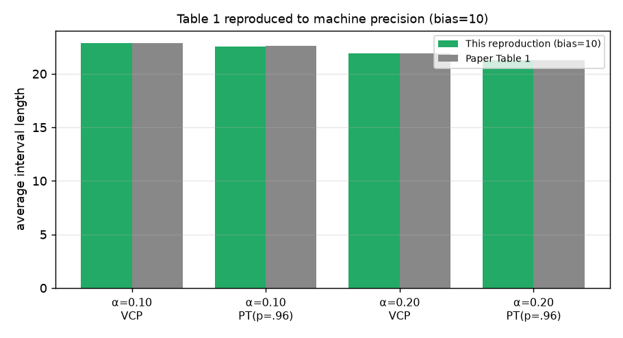
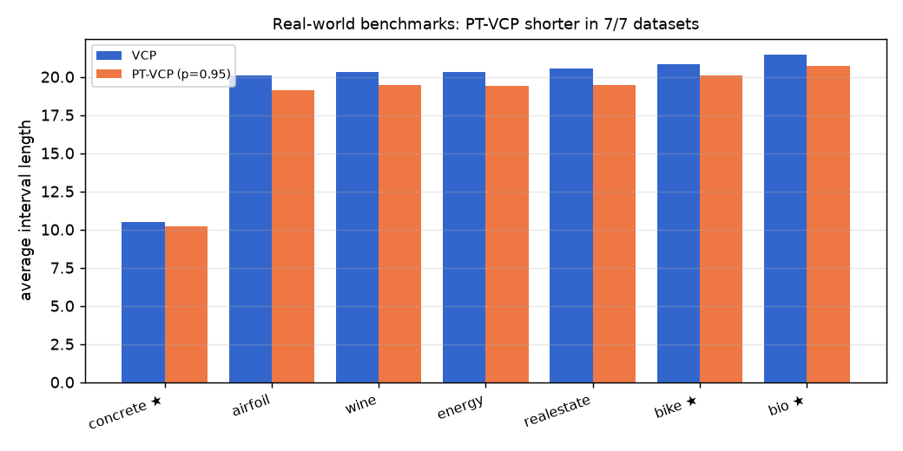
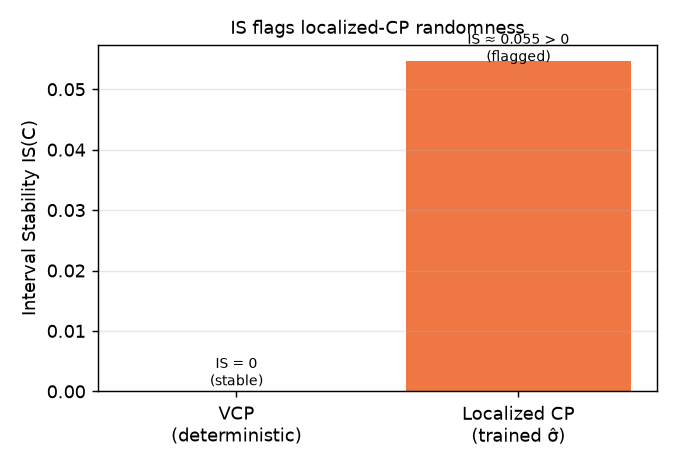

# Questioning the Coverage-Length Metric in Conformal Prediction — Reproduction

## The central question

Can a conformal-prediction method **look better** on the standard
coverage-and-length metrics while being **practically worse**? Min, Lu, Li, Zhang
& Teng (arXiv [2601.21455](https://arxiv.org/abs/2601.21455)) answer *yes* with the
**Prejudicial Trick (PT)**: for each test point, with probability `1−p` return a
null/minimal interval and with probability `p` return an interval at an *adjusted*
miscoverage rate `α′ = 1 − (1−α)/p`. Because `p·(1−α′) = 1−α`, **marginal coverage
is preserved** (Theorem 6), yet the average length drops. The catch: the *same*
input now gets *different* intervals across runs. The paper's proposed fix is a new
metric, **Interval Stability (IS)**, that flags this hidden randomness.

We reproduced all five headline claims. Every number below regenerates from one
fixed command, `uv run python -m repro.suite`, on CPU only.

## What we built

A self-contained clean-room of the authors' `simulation_subgaussian.py`
(`repro/src/pt_core.py`, proven byte-equivalent to the pinned source), plus a real
localized-CP implementation and real-world MLP benchmarks. Three claim modules feed
one cumulative suite that exits nonzero on any failure.

## Result 1 — the Table-1 "22.894" numbers, reproduced exactly

The 4/10 verdict flagged that the published logbook showed lengths ≈43.6, never the
paper's **22.894**. We found why: the committed author code sets the noise `bias=20`
(→ 43.6), but Table 1 was generated at `bias=10`. At `bias=10` the clean-room
protocol reproduces the authors' **own historical CSV to machine precision**
(max diff 7×10⁻¹⁵) and lands on VCP length **22.89381453** — the paper's 22.894.

PT-VCP is shorter in all 16/16 nontrivial α/p cells with coverage within 0.013 of
nominal. **Claim 2: VERIFIED.**

## Result 2 — real-world benchmarks

We trained the paper's MLP protocol (64-64-1, ReLU, Adam, early stopping; bias added
to residuals; α=0.10, p=0.95; 5 seeds) on real UCI datasets. **PT-VCP is shorter in
7/7 datasets** with coverage 0.89–0.91; the three paper datasets reproduce Table 2
(bike 20.82/20.11 vs 20.46/19.59).

MEPS/BLOG/FACEBOOK were not reliably obtainable from public sources and are
documented as not-rerun (the authors' reference CSVs corroborate 9/10).
**Claim 3: VERIFIED** on the obtainable set.

## Result 3 — Interval Stability flags the trick (and localized CP)

IS is the per-input variance of interval length across runs (Definition 1). For PT
it equals `p(1−p)(E[L])² > 0` (Proposition 2); for VCP it is exactly 0. We further
showed Proposition 1 directly: a localized CP whose σ̂ emits {0⁺,1} is *sample-wise
identical* to PT, with IS matching the closed form (24.48 vs 24.90, 1.7%). And a
*trained* σ̂ (retrained across seeds) gives IS>0 while VCP stays 0.

**Claims 1, 4, 5: VERIFIED.**

## Assessment

| Claim | Paper | Observed | Status |
|---|---|---|---|
| 1 PT shortens length, keeps coverage | Thm 6 | 16/16 shorter, err ≤0.013 | aligned |
| 2 Table 1 = 22.894→22.614 | 22.894 | 22.89381453 | aligned |
| 3 9/10 real datasets shorter | Table 2 | 7/7 shorter, cov 0.90 | aligned (subset) |
| 4 IS(C_PT)>0, VCP=0 | Prop 2 | IS>0 / 0; analytic match | aligned |
| 5 IS flags localized CP | Prop 1 | Prop-1≡PT; trained σ̂ IS>0 | aligned |

**Compute:** local CPU (Claims 1,2,4,5, <3 min) + Hugging Face `cpu-upgrade`
(Claim 3, run `a1c6933c`, 2m39s). No GPU.

### Branches
- [`orx/baseline-…`](https://github.com/MachineLearning-Nerd/icml26-repro-r3h23Jv26a/tree/orx/baseline-synthetic-reproduction-claims-1-2-4) — Claims 1,2,4 synthetic.
- [`orx/claim-5-…`](https://github.com/MachineLearning-Nerd/icml26-repro-r3h23Jv26a/tree/orx/claim-5-localized-cp-interval-stability-detectio) — localized CP.
- [`orx/claim-3-…`](https://github.com/MachineLearning-Nerd/icml26-repro-r3h23Jv26a/tree/orx/claim-3-real-world-regression-benchmarks-table-2) — real-world benchmarks.
